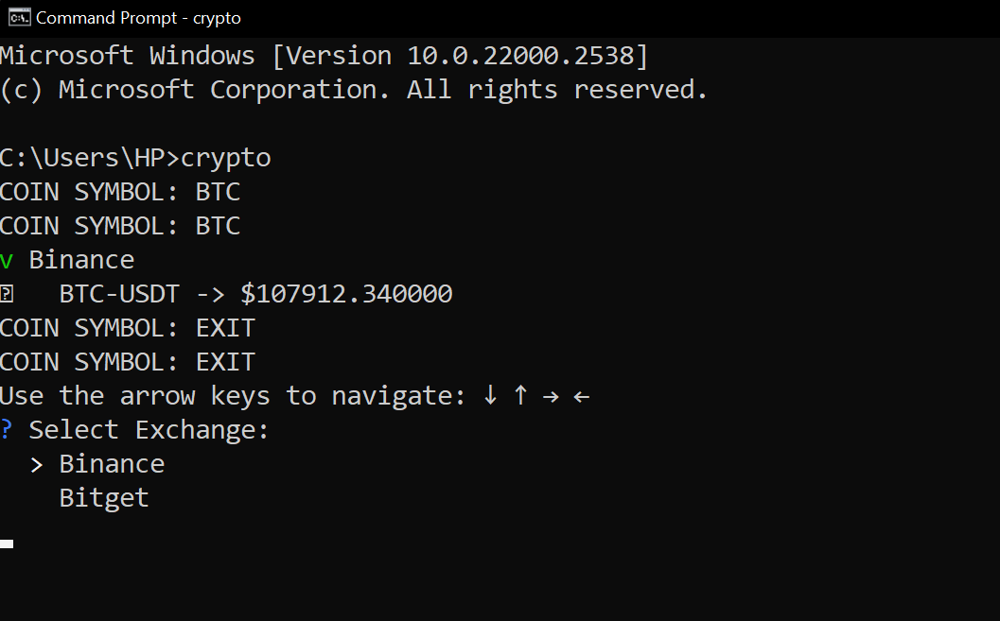

# Crypto CLI Tool

A simple and interactive command-line interface (CLI) tool written in Go for fetching real-time cryptocurrency prices from popular exchanges.

---


## Features

- Query live prices of any cryptocurrency trading against USDT.
- Supports Binance and Bitget public APIs.
- Validates coin symbols (only uppercase letters allowed).
- User-friendly terminal prompts with input validation.
- Continuous querying support with an interactive loop.
- Clear error handling and formatted price display.
---

## Installation

### Build from source

1. Clone this repository:

   ```bash
   git clone https://github.com/yourusername/crypto-cli.git
   cd crypto-cli
